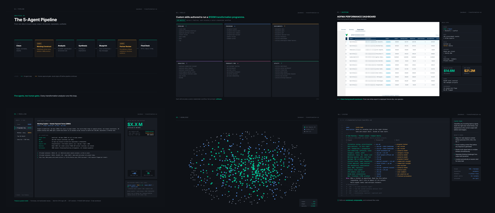
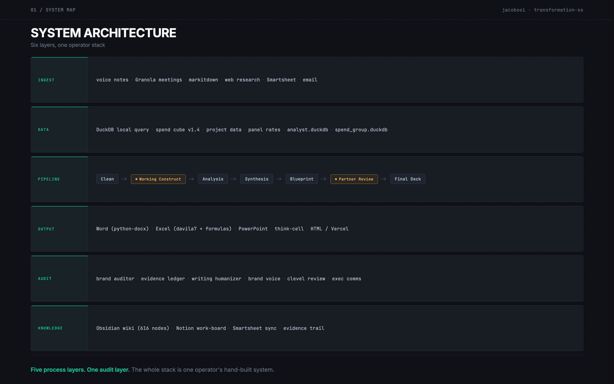
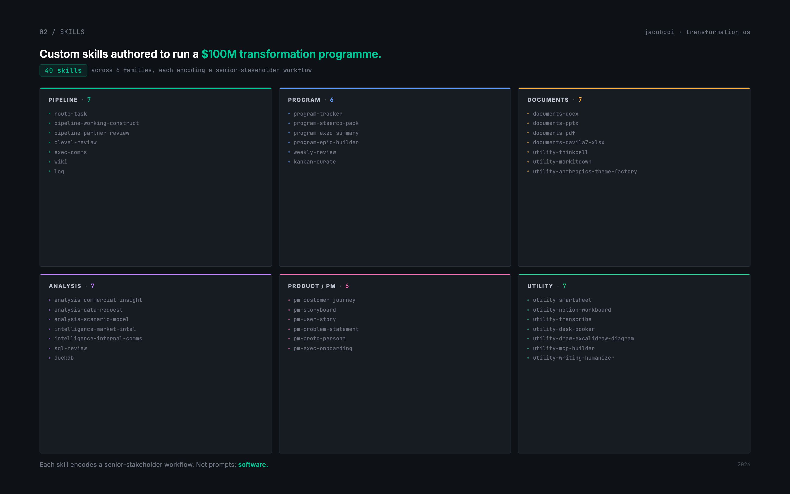
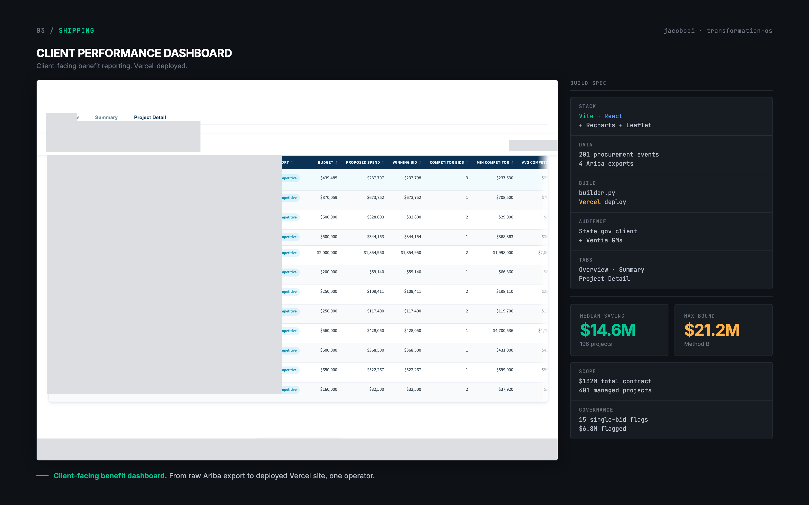
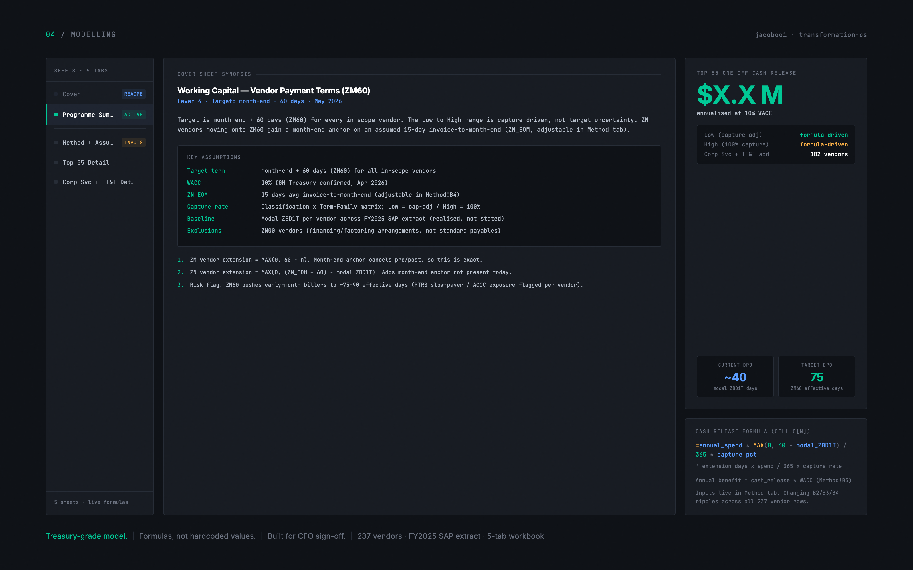
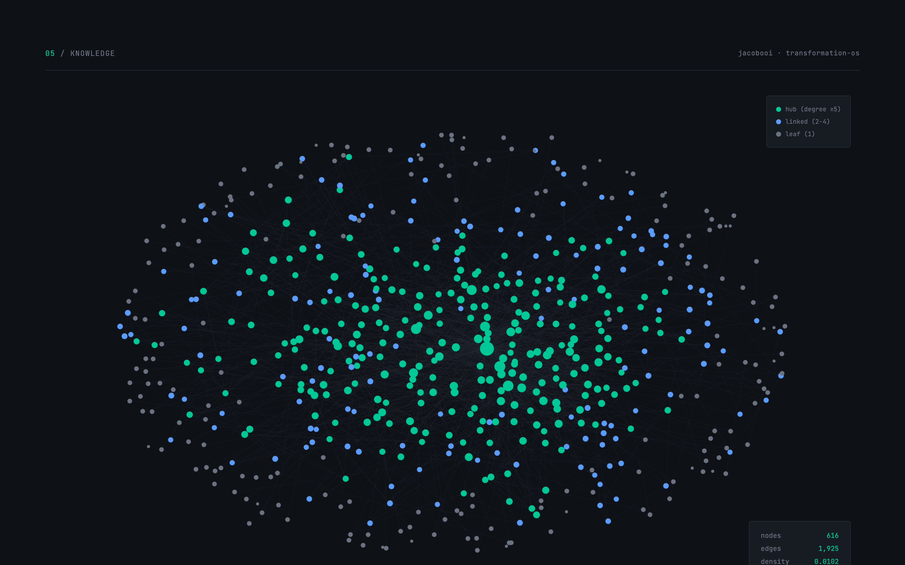
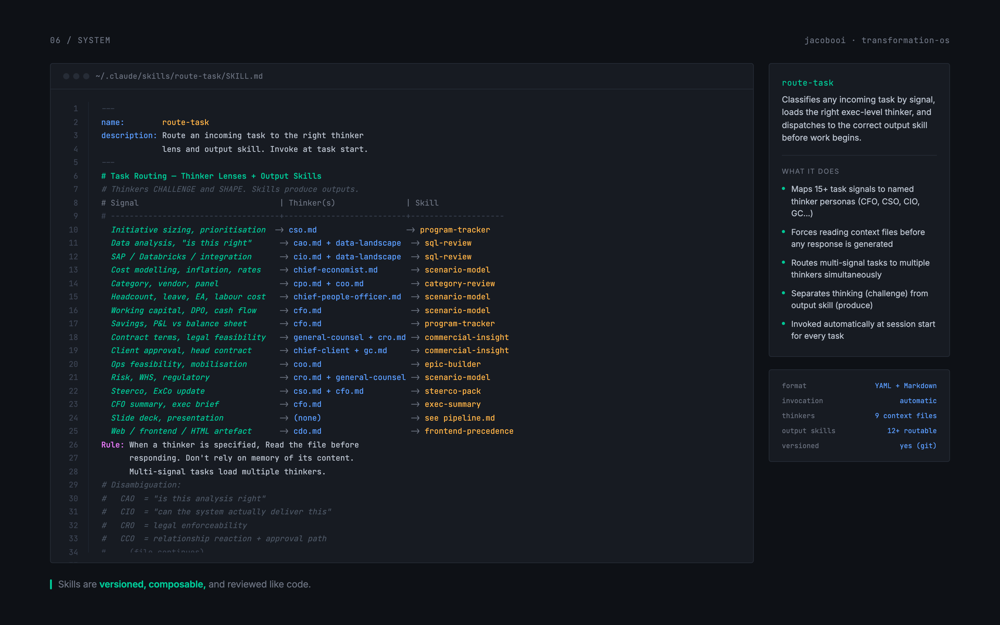

# transformation-os

**A hand-built Claude Code operating system for running senior transformation work.**



I run an 8 figure cost productivity programme at Ventia (ASX:VNT, $6B revenue, 35,000 people). This repository is the system I built to run it. Procurement reviews, working-capital models, board papers, client dashboards, evidence ledgers, all of it flows through here.

The premise: AI delivers leverage when it is engineered into the workflow, not summoned ad-hoc.

---

## What is in here

```
.
├── skills/             40 custom Claude Code skills
│   ├── pipeline/       five-agent analytical pipeline + gates
│   ├── program/        transformation programme management
│   ├── documents/      executive Word / Excel / PowerPoint output
│   ├── analysis/       data + commercial insight
│   ├── product/        scoping + storyboarding + personas
│   └── utility/        integrations: Smartsheet, Notion, SAP, DuckDB
├── methodology/        the pipeline, the gates, the audit logic
├── examples/           sanitised artefacts from real programme work
└── docs/               diagrams + tiles + screenshots
```

---

## The system



Six layers. Ingest, data, pipeline, output, audit, knowledge. The pipeline is the spine, but the surface around it is what makes the work survive an executive review.

### The pipeline layer

Five agents and two human-approval gates run every analytical deliverable:

| Stage | What it does |
|---|---|
| **Agent 1: Clean** | Ingest, normalise, classify |
| **Gate: Working Construct** | Hypothesis-driven story skeleton (MBB practice). I sign off before any analysis runs |
| **Agent 2: Analysis** | DuckDB, spend cube, structured data cuts |
| **Agent 3: Synthesis** | Findings to implications |
| **Agent 4: Blueprint** | Deck architecture and key messages |
| **Gate: Partner Review** | Pre-delivery critique: substance, structure, audience |
| **Agent 5: Final Deck** | PPTX / Word / HTML, executive-ready |

The gates are not optional. They exist because exec deliverables die at the partner review, not at the analysis.

---

## The skills



Each skill is versioned markdown with a structured front-matter. Skills are composable, idempotent where possible, and reviewed like code. The interesting ones:

- `route-task` — routes any incoming task to the right thinker lens (CSO/CFO/CAO etc.) and the right output skill
- `pipeline-working-construct` — builds the hypothesis skeleton before analysis runs
- `pipeline-partner-review` — pre-delivery critique simulating an MBB partner pass
- `clevel-review` — gate for any senior-audience deliverable
- `exec-comms` — visual + structural format discipline (callouts, parallel tables, banned-word scans)
- `program-steerco-pack` — board-grade programme view from live data
- `program-exec-summary` — one-page summaries that survive an ExCo
- `analysis-commercial-insight` — classifies cost problems by lever, timeline, and size before any analysis runs
- `documents-davila7-xlsx` — Excel outputs with formulas, cover sheet, brand audit baked in

---

## What it ships



Real outputs from real programme work, sanitised:

- Client-facing benefit dashboards (React + Recharts on Vercel)
- Treasury-grade working capital models (live formulas, CFO-defensible audit trail)



- Steerco packs and decision briefs (Word + PPTX, brand-audited)
- Category reviews backed by 8M+ rows of SAP spend (DuckDB local query layer)

---

## The knowledge layer



Every analysis writes back to an Obsidian wiki. Each project log, every decision, every commercial insight. The wiki has roughly 385 notes connected by 2,870 links, forming a navigable graph the next analysis can query.

This is not a sidecar. It is the difference between AI as a fancy autocomplete and AI as a teammate that remembers.

---

## The learning loop

The system remembers not just projects, but mistakes. Every silent SQL trap, every library that produces files the reader cannot open, every field that lies about its contents: each one becomes a durable engineering rule that gets written into the standards, not just fixed and forgotten. The next build avoids it.

This is the efficiency flywheel. Rework cycles compound in the wrong direction; captured gotchas compound in the right one. After enough cycles the build is correct on the first pass because the traps were already catalogued.

The catalogue holds twenty rules today, each traceable to a build that failed once. The full set is in [`methodology/engineering-standards.md`](methodology/engineering-standards.md).

---

## A skill from the inside



Skills are not prompts. They are versioned software. They have a description, a trigger contract, a process, and an output specification. They are reviewed, audited, refactored, and removed.

---

## Why this repo exists

Three reasons:

1. **Most public AI content is toy demos.** Senior operators need to see real workflows that survive a real partner review. There is not enough of this online. Here is one.
2. **The system is the value.** Individual prompts are commodities. The opinionated, composed, audited system is what produces leverage at the ExCo level.
3. **I want to talk to AI companies building for senior operators.** This repo is the fastest way to show what I care about: orchestration, taste, audit, accountability.

---

## What is NOT in here

For commercial and confidentiality reasons:

- No Ventia financials, vendor names, contract counterparties, or specific $ savings by category
- No client-confidential outputs (the dashboards in `/examples/` are sanitised)
- No internal Ventia data (the SAP / spend cube / project data files are not committed)
- No personal correspondence

The skills themselves are generic. They work in any senior-stakeholder workflow.

---

## About

**Jacob Ooi**. Sydney. Head of Transformation, Ventia Infrastructure Services.

- LinkedIn: [linkedin.com/in/jacobooi](https://www.linkedin.com/in/jacobooi/) (DM is the fastest way to reach me)

Open to conversations with AI teams. Most interested in agentic orchestration, evaluation, audit, and taste.

---

## Licence

MIT for the skills themselves. The methodology is what it is: borrow it, fork it, ship better than I did.
